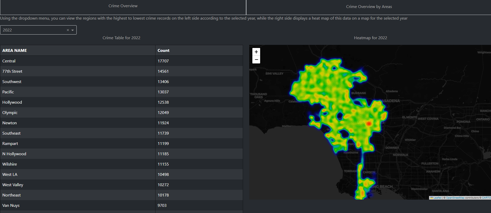
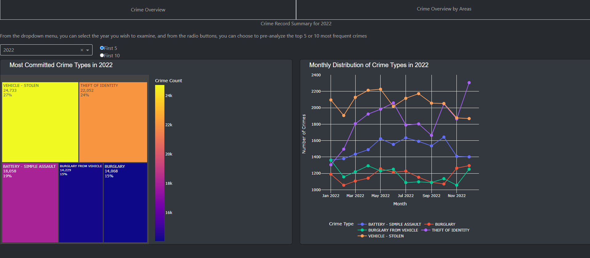

<table>
  <tr>
    <td><h1>Hi there 👋  Freeze Police ! 👮</h1></td>
    <td></td>
  </tr>
</table>

### Languages, Libraries, Tools & Technologies that I used in this project

In this repository you can found the code of one of my portfolio project, "Crime DashBoard at Chicago". The raw data got from "https://www.kaggle.com/datasets/sudhanvahg/crimes-in-las-angeles/data". The raw data includes various crimes from 2020 to 2023, and the location and time of these crimes. However, the data for 2023 is not fully available.

You can find two different files in this project. The first is a jupyternotebook file to run on your local computer, and the second is the app.py code that is designed to publish the dashboard that I published on my portfolio site on pythonanywhere.com.  - https://onurdata.pythonanywhere.com/ -

✨⭐ app.py file and jupyter notebook file are in the codes file. In the assets file you can find the giff and pictures I used while making readme.md file ⭐✨

### Introduction

As the output of app.py, you can see two different graphs in two different tabs. In the first one, you can see a treemap of crime types and the change of these crime types depending on the months on the line graph. In addition, you can choose between the first 5 or first 10 crimes for the year you want to examine and after.

In the second tab, you can get geographical information about crimes and years. On one side, you can see the names of the regions with the highest crime records to the lowest, depending on the selected year, while on the right side, you can see the geographical map with a heat map of this data shown on the folium. Additionaly, The html of the folium maps in the second tab were created with the python codes in the folium_map.app file.

<table>
  <tr>
    <td></td>
    <td></td>
  </tr>
</table>

